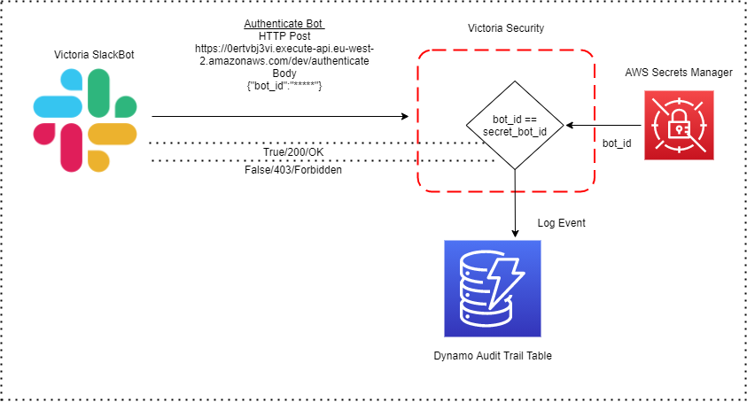
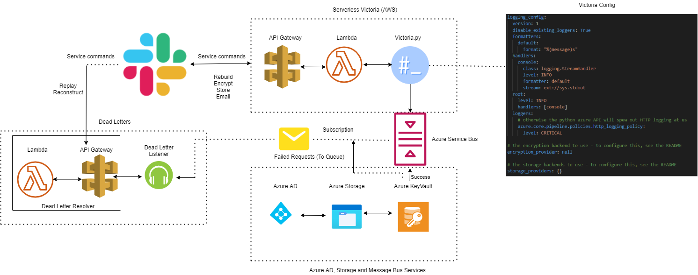

# Serverless Victoria

This is a very very early prototype of Victoria running serverless. Not ready
for production.

The serverless solution used is AWS Lambda.

## User guide
The Lambda has a HTTP trigger on `POST`. The body should be JSON:
```json
{
    "args": ["the", "args", "to", "victoria"]
}
```

The `args` are literally just the command-line arguments you would normally
pass to victoria, for example if you wanted to print the help text then:

```json
{
    "args": ["-h"]
}
```

Or if you wanted to print the config file:

```json
{
    "args": ["config", "view"]
}
```

The response is just whatever Victoria printed to stdout, including escaped
special characters (like `\n`).

## Developer guide

### Prerequisites
- Python 3.8 64-bit
- Serverless framework

### Quick start
1. Clone the repo.
2. Run `pipenv sync --dev`
3. Run tests `python -m unittest`, `pytest -v tests/test_awslambda.py`
4. You're good to go.

### Deploying
1. `pipenv run freeze`
2. `sls plugin install -n serverless-python-requirements`
3. `serverless deploy`

## Architecture Diagram

### Slack Authentication with Victoria



### Serverless Workflow Architecture



